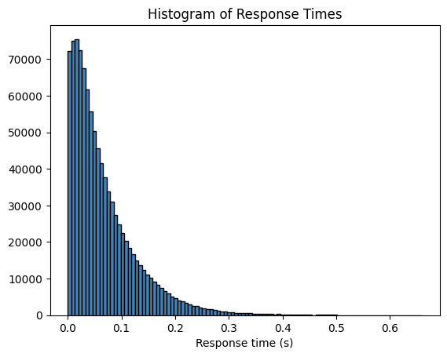
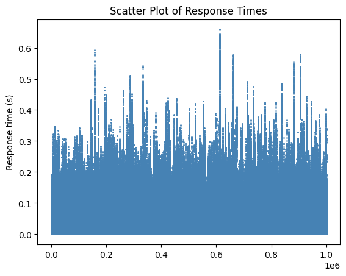
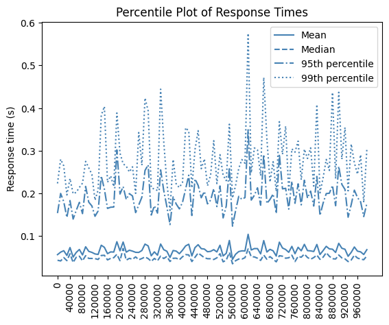
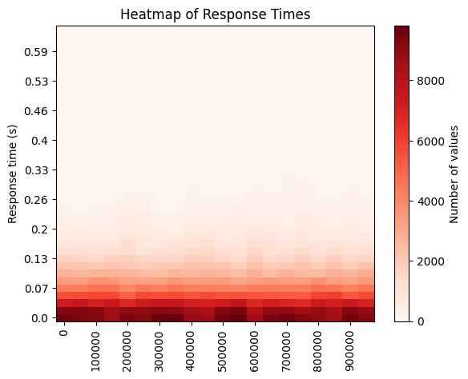

Lab report: capacity planning and performance analysis with SimPy
========================================================================

Result table
------------

This table documents the results of the different simulation scenarios

| Case                                                | Required service rate | Mean service time   | Response time      |
|-----------------------------------------------------|-----------------------|---------------------|--------------------|
| 1a. Base scenario: $\lambda = 90/s$                 | $\mu = 100 /s$        | $1/\mu$ = 10 ms     | mean: 100 ms       |
| 1b. M/M/1 model for $\lambda = 180/s$               | $\mu = 190 /s$        | $1/\mu$ = 5.26 ms   | mean: 100 ms       |
| 2a. Batch arrivals with $\lambda_\text{web} = 18$/s | $\mu = 127 /s$        | $1/\mu$ = 7.87 ms   | mean: 100 ms       |
| 2b. Batch arrivals with $\lambda_\text{web} = 36$/s | $\mu = 217 /s$        | $1/\mu$ = 4.61 ms   | mean: 100 ms       |
| 3a. Batch arrivals with $\lambda_\text{web} = 18$/s | $\mu = 143 /s$        | $1/\mu$ = 6.99 ms   | 99th perc.: 300 ms |
| 3b. Batch arrivals with $\lambda_\text{web} = 36$/s | $\mu = 234 /s$     v  | $1/\mu$ = 4.27 ms   | 99th perc.: 300 ms |


Case 1a: Base scenario
----------------------

Scenario

- M/M/1 model
- $\lambda = 90$ requests per second
- Target response time $E[t] = 100$ ms

Use the analytical model to compute required service rate $\mu$. Report the value in the table on top.
```output simpy_m_m_1.py
arrival_rate = 90.0
service_rate = 100.0
Mean response time: 0.1011 s
Response time (99th percentile): 0.4684 s
```

Case 1b: Doubling the arrival rate
----------------------------------

Use the same scenario as in Case 1a, but double the arrival rate $\lambda$.

Use the analytical model to compute the required service rate $\mu$. Report it in the table on top.

**Question**: does the service rate need to double, too? Interpret the result.

**Answer**: No, the service rate does not need to double. Using the M/M/1 model, the required service rate $\mu$ to achieve the same mean response time $E[T]$ when the arrival rate $\lambda$ is doubled to 180 requests per second is 190 requests per second. 
This is because the mean response time $E[T]$ is given by:

\[ E[T] = \frac{1}{\mu - \lambda} \]

To maintain the same mean response time of 100 ms, the service rate $\mu$ needs to be adjusted to 190 requests per second.
```output simpy_m_m_1.py
arrival_rate = 180.0
service_rate = 190.0
Mean response time: 0.1011 s
Response time (99th percentile): 0.4684 s
```

Case 2a: Batch arrivals
-----------------------

Simulate the model with batch arrivals and an arrival rate of Web pages (not file requests) of $\lambda = 90$ web requests per second.

Which service rate is required to achieve a mean response time of $E[t] = 100$ ms. Report this result in the table on top.

**Question**: interpret this result!

**Answer**: To achieve a mean response time of 100 ms with batch arrivals, the required service rate $\mu$ is calculated using the simulation model. 
The arrival rate of file requests is determined by the number of files per web page, which follows a uniform distribution between 1 and 9. 
The required service rate $\mu$ is found to be 127 requests per second.
```output simpy_batch.py
arrival_rate_web = 18.0
service_rate = 127.0
Mean response time: 0.0993 s
Response time (99th percentile): 0.4351 s
```

Case 2b: Batch arrivals and double arrival rate
-----------------------------------------------

Determine the service rate \$mu$ that is required if the arrival rate of Web pages doubles and we want to achieve a response time of 100 ms.

Report this result in the table on top. Interpret the result.
```output simpy_batch.py
arrival_rate_web = 36.0
service_rate = 216.0
Mean response time: 0.1010 s
Response time (99th percentile): 0.4430 s
```


Case 3a: Batch arrivals and 99th percentile
-------------------------------------------

Determine the service rate $\mu$ that is required such that the 99th percentile of the response time is around 300 ms.

Report this result in the table on top. Interpret the result.

```output simpy_batch.py
arrival_rate_web = 18.0
service_rate = 143.0
Mean response time: 0.0689 s
Response time (99th percentile): 0.2950 s
```


Case 3b: Batch arrivals, double arrival rate and 99th percentile
----------------------------------------------------------------

Determine the service rate \$mu$ that is required if the arrival rate of Web pages doubles such that the 99th percentile of the response time is around 300 ms.

Report this result in the table on top.
```output simpy_batch.py
arrival_rate_web = 36.0
service_rate = 234.0
Mean response time: 0.0681 s
Response time (99th percentile): 0.3014 s
```


Visualization
-------------

Use the plot functions defined in the file `visualization/plots.py` to visualize the response time distribution for the case 3b (Batch arrivals, double arrival rate and 99th percentile).

Include each plot in this report and interpret the results.



The histogram shows the distribution of response times for the case 3b scenario. The response time is measured in seconds and the number of occurrences is shown on the y-axis. The distribution is skewed to the right, with most response times clustered around the mean value. The 99th percentile of the response time is around 300 ms, which means that only 1% of users will experience a response time greater than this value.



The scatter plot shows the response time of each request in the simulation. The x-axis represents the time of the request, while the y-axis shows the response time in seconds. The plot shows that the response time varies for each request, with some requests taking longer to process than others. The 99th percentile of the response time is around 300 ms, which means that only 1% of users will experience a response time greater than this value.



The line plot shows the response time percentiles for the case 3b scenario. The x-axis represents the percentile value, while the y-axis shows the response time in seconds. The plot shows that the response time increases as the percentile value increases, with the 99th percentile of the response time around 300 ms. This means that only 1% of users will experience a response time greater than this value.



The heatmap shows the response time distribution for the case 3b scenario. The x-axis represents the time of the request, while the y-axis shows the response time in seconds. The color intensity represents the number of occurrences of each response time value. The heatmap shows that most response times are clustered around the mean value, with some requests taking longer to process than others. The 99th percentile of the response time is around 300 ms, which means that only 1% of users will experience a response time greater than this value.

Conclusion
----------

Document your conclusions here. What did you learn from the simulation results?

This lab emphasized the importance of understanding how arrival rates and service rates influence response times in queuing systems. Achieving an average response time of 100ms requires adjusting the service rate (μ) to account for factors like batch arrivals and the number of files per web page. The 99th percentile response time proved to be a valuable metric for evaluating system performance under high load conditions. Using simulation tools like SimPy provided practical insights into how response times vary with system parameters, while visualizations highlighted the variability and performance trends. By combining analytical models with simulation results, I gained a deeper understanding of queuing system behavior, which is crucial for effective capacity planning and system optimization.